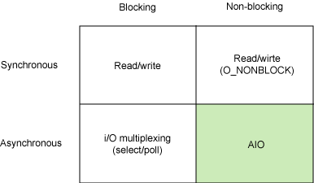

## Today I Learned 
> 이해가 잘 안되고, 자주 까먹는 내용을 정리

* 정리
  * [Database](#database)
  * [Docker](#docker)
  * [GIT](#git)
  * [GOF](#gof-design-patterns)
  * [I/O](#input-output)
  * [Java](#java)
  * [Markdown 문법](#markdown)
  * [TCP/IP](#tcp-ip)
  * [Unix 명령어](#command)
  * [간단 Issues](#issues)
  * [기본 개념](#basic-programming)
* 설치
  * [Git Page](#git-page) on Mac (OS X El Capitan 10.11.6)
  * [Java](#java-install) on Centos 7
  * [Pylucene](#pylucene-install) on Mac (OS X El Capitan 10.11.6)
  * [Cacti](#cacti-install) on Redhat 7.2 
  * [Zabbix](#zabbix-install) on Redhat 7.2 
  * [Eclim](#eclim-install) on Ubuntu 14.04
  * [Maria db](#mariadb-install) on Redhat 7.2
  * [간단 설치](#simple-install) 

## Docker
* [한글 문서 모음](http://documents.docker.co.kr)
* 매번 까먹는 명령
  * Docker 데몬 띄우기

  ```
  $ docker-machine start
  $ docker-machine ssh default
  ```
  * Docker 이미지 시작 

  ```
  $ docker start $ContainerID
  $ docker attach $ContainerID
  ```

  * Docker 추가 

  ```
  $ docker run -i -t --name new_centos centos /bin/bash
  ```

  * Docker Rename

  ```
  $ docker rename OLD_NAME NEW_NAME
  ```

## Git
* Pull request
  * master 계정이 아닌 다른 계정으로 login 하여 수행

```
 git branch pr_test
 git checkout pr_test
 git commit Array.java
 git push origin pr_test
```

* branch에서 origin merge 하기

```
git merge origin/master
```

* repository merge

merge `project-a` into `project-b`:

```
cd path/to/project-b
git remote add project-a path/to/project-a
git fetch project-a
git merge project-a/master # or whichever branch you want to merge
git remote remove project-a
```


## Gof Design Patterns
* Gang of Four 23 design patterns

  * Creational Patterns : 생성 패턴
    * Abstract Factory
    * Builder
    * Factory Method
    * Prototype
    * Singleton
  * Structural Patterns : 구조 패턴
    * Adapter
    * Bridge
    * Composite
    * Decorator
    * Facade
    * Flyweight
    * Proxy
  * Behavioral Patterns : 행위 패턴
    * Chain of Responsibility
    * Command
    * Interpreter
    * Iterator
    * Mediator
    * Memento
    * Observer
    * State
    * Strategy
    * Template Method
    * Visitor

## Git Page

1. 페이지 생성 ([pages.github.com](https://pages.github.com/#setup-in-desktop))

2. 테마 설정 ([jekyll](https://help.github.com/articles/setting-up-your-github-pages-site-locally-with-jekyll/) 사용)

* 설치 중 ERROR

```
An error occurred while installing nokogiri (1.6.8), and Bundler cannot continue.
Make sure that `gem install nokogiri -v '1.6.8'` succeeds before bundling.
```

  * [nokogiri](http://www.nokogiri.org/tutorials/installing_nokogiri.html#mac_os_x)  설명 확인 후 해결

```
 bundle config build.nokogiri --use-system-libraries
 bundle install
```

## Java Install
* [pinpoint](https://github.com/naver/pinpoint) 해보려다가 Java 6,7,8 모두 필요해서 설치하게 됨 ([설치 참고](https://www.digitalocean.com/community/tutorials/how-to-install-java-on-centos-and-fedora))
* JAVA 7 예시, centos라서 yum 사용 
  * JRE install 

  `sudo yum install java-1.7.0-openjdk`

  * JDK install 

  `sudo yum install java-1.7.0-openjdk-devel`

  * java version 선택 명령어

  `update-alternatives --config java`

  * java 환경 설정 확인

  `java -XshowSettings:properties version`

## Command
* 전체 명령어 확인 ([Unix & Linux Forums](http://www.unix.com/unix-commands.php))
* 명령어 사용 예시
  * __[find](#find)__
  * __[ps](#ps)__ 
  * __[ls](#ls)__ 
  * __[awk](#awk)__ 
  * __[sar](#sar)__ 
* __tmux__ ([tmux](https://tmux.github.io/))
  * ctrl + b 누르고 __`손을 떼고나서`__ 다음 옵션키를 누르는 걸 몰라서 엄청 해맴 ㅜ.ㅜ

* __useradd__ 사용자 추가 (useradd 만으로 되긴함...)

```
// Centos
useradd -d /home/tf -u 1002 -s /bin/csh tf
passwd tf

// Ubuntu
useradd nfv -m -s /bin/csh   // chsh로 shell 변경 가능
passwd nfv
```

* __snmpwalk__ 정보 가져오기 

```c
# Linux
snmpwalk 201.10.3.152:40101 -v 2c -c public .1.3.6.1.4.1.11065.10000.1.2.2 
snmpwalk 201.10.3.191:35300 -v 2c -c public .1.3.6.1.4.1.11065.10030.1.2.2

# Solaris 
snmpwalk -v 2c -c public -m ALL 114.207.73.213:35023 .1.3.6.1.4.1.11065.10038.1.2.1
snmpwalk 114.207.73.213:35023 -v 2 -c public 1.3.6.1.4.1.11065.10038.1.2.3
```

* __strace__ 명령으로 쓰레드 구분해서 파일에 덤프

`strace -p[PID] -ttTf -o [file name]`

* Make 수행 후 error, warning 파일에 redirection 하기 ([stack overflow 참고](http://stackoverflow.com/questions/16350579/redirecting-standard-error-to-file-and-leaving-standard-output-to-screen-when-la))

`make | & tee output.txt`

* __date__  시간 변경하기

```
[Ubuntu]
# dpkg-reconfigure tzdata

[Centos, Redhat]
# ln -sf /usr/share/zoneinfo/Asia/Seoul /etc/localtime
```

* sudoer 추가하기

```
[Centos]
# vi /etc/sudoers

## Allow root to run any commands anywhere
root    ALL=(ALL)       ALL
jeon    ALL=(ALL)       ALL     ; <-- 추가

```

## Find
* 비어있는 디렉토리 찾기

`find . -empty -type d `

* 100MB 이상 크기 파일 찾기

`find . -type f -size +100M -exec ls -alh {} \; `

* 파일이 100개 이상인 디렉토리 찾기 

`find / -type f | sed 's,/[^/]*$,,' |sort |uniq -c | awk '$1>=100'`

## PS
* Linux System Memory 사용률 확인

`ps aux | awk '{print $1,$2,$4,$11}' | sort -k 3 -nr | head -n 10`

## LS
* 현재 디렉토리 전체 파일 사이즈 확인

` ls -lh | head -1`

## AWK
* `/var/log/message`(centos)에서 1분마다 이벤트 발생 횟수 가져오기

`awk -F: {'print $1 ":" $2'} messages`

## SAR
* 특정 날짜 메모리 정보 가져오기 

```
cd /var/log/sa
sar -r -f sa26
```

## Markdown
* [Cheatsheet](https://github.com/adam-p/markdown-here/wiki/Markdown-Cheatsheet)
* 1 페이지 안에서 링크 생성하기 ([stack overflow 참고](http://stackoverflow.com/questions/6695439/how-do-you-create-link-to-a-named-anchor-in-multimarkdown))

```
Go to section
* [Hello](#hello)  
* [Hello World](#hello-world)
* [Another section](#new-section)  <-- 'Another section' but refers to 'New section'

## Hello
### Hello World
## New section
```
* 이미지에 대한 캡션 삽입 ([stack overflow 참고](http://stackoverflow.com/questions/19331362/using-an-image-caption-in-markdown-jekyll))

```html
<p>
    
    <em>image_caption</em>
</p>

아니면 
<p>
    
</p>
<p>
    <em>image_caption</em>
</p>

```

## Java
* static 키워드 ([tistory blog](http://rockdrumy.tistory.com/214))
  * 안 바뀜 -> 공통 사용 -> 메모리 절약

* [JVM](http://yckwon2nd.blogspot.kr/2014/04/garbage-collection.html)
* [JVM, JRE, JDK 차이](https://wikidocs.net/257)
  * Java Virtual Machine
  * Java Runtime Environment
  * Java Development Kit

* 자바 환경 설정 확인 명령어 

` java -XshowSettings:properties -version `

## Input Output
* [Linux Models](#linux-models) 
* [Non-blocking Algorithm](#non-blocking-algorithm)


## Linux models 
* Blcoking, Non-blocking, Synchronous, Asynchronous 정리 ([blog 설명](http://djkeh.github.io/articles/Boost-application-performance-using-asynchronous-IO-kor/), [IBM 원본](http://www.ibm.com/developerworks/library/l-async/))

<p>
    
</p>

## Non Blocking Algorithm
* 요약하여 정리 ([blog 설명](http://ozt88.tistory.com/38), [영어 위키](https://en.wikipedia.org/wiki/Non-blocking_algorithm))

  * Wait-Free
    * 가장 이상적인 수준
    * 전체 쓰레드가 공유 자원을 일관적으로 사용하면서 대기 없이 진행 

  * Lock-Free
    * 일반적인 수준 
    * 항상 하나 이상의 자원이 유한한 단계에 획득하고 사용을 끝냄 
    * 어떤 쓰레드가 자원을 획득할지 결정적이지 않음
      * [CPU starvation](https://www.ibm.com/developerworks/community/blogs/WebSphere_Process_Server/entry/hungry_cpu?lang=en)을 완전히 극복할 수는 없음

  * Obstruction-Free
    * 가장 낮은 수준
    * 충돌중인 쓰레드를 멈추게해야한다는 점에서 Blocking에 가까움
    * 한개를 제외하고 다른 모든 쓰레드를 대기시킴
      * 자원을 획득한 쓰레드가 사용을 끝냄 

## Tcp ip
* [OSI 7 Layer](#osi-layers)
* [Subnet](#subnet)
* [패킷 전송](#packet-travel)
* [네트워크 Stack 이해하기](http://d2.naver.com/helloworld/47667)
* [TCP 커널 파라메터 이야기](http://meetup.toast.com/posts/53)

## OSI layers 
* 계층 7 구성

No. | 계층 | 프로토콜
:------:| :------------: | ----------- 
7 | [응용](https://ko.wikipedia.org/wiki/%EC%9D%91%EC%9A%A9_%EA%B3%84%EC%B8%B5) | NNTP, SIP, SSI, DNS, FTP, 고퍼, HTTP, NFS, NTP, <br> SMPP, SMTP, DHCP, SNMP, Telnet, [더보기](https://ko.wikipedia.org/wiki/%EB%B6%84%EB%A5%98:%EC%9D%91%EC%9A%A9_%EA%B3%84%EC%B8%B5_%ED%94%84%EB%A1%9C%ED%86%A0%EC%BD%9C)
6 | [표현](https://ko.wikipedia.org/wiki/%ED%91%9C%ED%98%84_%EA%B3%84%EC%B8%B5) | MIME, XDR, TLS, SSL
5 | [세션](https://ko.wikipedia.org/wiki/%EC%84%B8%EC%85%98_%EA%B3%84%EC%B8%B5) | 지명파이프, 넷바이오스, SAP
4 | [전송](https://ko.wikipedia.org/wiki/%EC%A0%84%EC%86%A1_%EA%B3%84%EC%B8%B5) | TCP, UDP, SCTP, DCCP
3 | [네트워크](https://ko.wikipedia.org/wiki/%EB%84%A4%ED%8A%B8%EC%9B%8C%ED%81%AC_%EA%B3%84%EC%B8%B5) | IP, ICMP, IPsec, IGMP, IPX, 애플토크
2 | [데이터 링크](https://ko.wikipedia.org/wiki/%EB%8D%B0%EC%9D%B4%ED%84%B0_%EB%A7%81%ED%81%AC_%EA%B3%84%EC%B8%B5) | ARP, CSLIP, SLIP, 이더넷, 프레임릴레이, PPP, PPTP, <br> L2TP, ITU-T G.hn DLL
1 | [물리](https://ko.wikipedia.org/wiki/%EB%AC%BC%EB%A6%AC_%EA%B3%84%EC%B8%B5) | RS-232, RS-485, DSL, 802.11a/b/g/n PHY, USB, Bluetooth


## Subnet
* subnetwork을 줄인 말로서 어떤 기관에 소속된 네트웍이지만 따로 분리되어 있는 한 부분으로 인식될 수 있는 네트웍을 말한다. 일반적으로 하나의 서브넷은 하나의 지역, 한 빌딩 또는 같은 근거리통신망 내에 있는 모든 컴퓨터들을 나타낼 수 있다. 여러 개의 서브넷으로 나뉘어진 어떤 조직의 네트웍은 인터넷에 하나의 공유된 네트웍 주소로 접속될 수 있다. 만약 서브넷이 없다면, 그 조직은 물리적으로 분리된 서브 네트웍마다 하나씩, 여러 군데의 인터넷 접속을 가지게 될 것이며, 그렇게 함으로써 한정된 량의 인터넷 주소가 쓸모 없이 낭비될 수도 있게된다.([텀즈](http://www.terms.co.kr/subnet.htm))

  * Subnet Mask [netmanias 참고](http://www.netmanias.com/ko/?m=view&id=blog_nwp&no=5403&tag=180)


## Packet Travel
*  L3 스위치의 패킷 전달 로직 ([netmanias 참고](http://www.netmanias.com/ko/?m=view&id=blog_nwp&no=5515), [stack overflow 참고](http://stackoverflow.com/questions/16125987/how-does-a-packet-travel-from-one-computer-to-another-over-the-internet-based-on))

## Database
* [Mysql](#mysql)

## MySQL
* [쿼리](#mysql-query)
* vertical mode (쿼리 결과를 세로로 보고 싶을 때, 1개의 row만 상세히 보고 싶을 때)

```
% mysql -uroot -pasdfsdf --vertical
mysql>  select * from test;

```

## MySQL Query
* 테이블이 사용하고 있는 data 크기 및 engine 정보 가져오기 ([stack overflow 참고](http://stackoverflow.com/questions/9620198/how-to-get-the-sizes-of-the-tables-of-a-mysql-database))

```sql
SELECT 
    table_name AS `Table`, 
    round(((data_length + index_length) / 1024 / 1024), 2) `Size in MB`, 
    engine 
FROM information_schema.TABLES 
WHERE table_schema ="$TABLE_NAME";
```

* `*.csv` 엑셀파일 import ([stack overflow 참고](http://stackoverflow.com/questions/11077801/import-csv-to-mysql-table))

```sql
% mysql --local-infile -uMY_USER -pMY_PASSWORD
...
mysql> use MY_DATABASE
...
mysql> LOAD DATA LOCAL INFILE '/Users/test-u/Downloads/test4.csv' INTO TABLE CHECK_RSC FIELDS TERMINATED BY ',';
Query OK, 2546 rows affected, 21421 warnings (0.12 sec)
    Records: 2546  Deleted: 0  Skipped: 0  Warnings: 21421
```

* 현재 실행 중인 쿼리 조회 ([stack overflow 참고](http://stackoverflow.com/questions/16571416/how-can-i-get-a-full-list-of-all-queries-currently-running-on-my-mysql-server))

```sql
mysql> SHOW FULL PROCESSLIST;
```

* 아이템이 없는 항목 찾기
```sql
SELECT DISTINCT server_id FROM ALARM WHERE (SELECT COUNT(*) FROM ALARM) NOT IN (0) ORDER BY server_id;
```

## Pylucene Install
* [Apache Lucene](https://lucene.apache.org/pylucene/install.html)에서 시키는 대로 하면 됨 (pylucene-4.10.1-1)
 * [JCC](http://jcc.readthedocs.io/en/latest/) 사용
  * 설치 시 주의 사항
    * JAVA_HOME 설정 확인
    * `pylucene-4.10.1-1/Makefile` 직접 주석을 풀어줘야함.

## Cacti Install
* 설치 OS(Red Hat Enterprise Linux Server release 7.2)

[1] Install apache

```sudo yum install httpd httpd-devel -y```

[2] Install Mysql

```sudo yum install mysql mysql-server -y
sudo yum install mariadb-server -y
```

[3] Install PHP

```sudo yum install php-mysql php-pear php-common php-gd php-devel php php-mbstring php-cli -y```

[4] Install PHP-SNMP

[FAILED] 
```sudo yum install php-snmp -y```

[5] Install NET-SNMP

```
sudo yum install net-snmp-utils net-snmp-libs -y
sudo yum install net-snmp -y
```

[6] Install RRDTool

```sudo yum install rrdtool -y```

[7] start daemon

```
sudo systemctl start httpd
sudo systemctl start mariadb.service
sudo systemctl start snmpd
```

[8] install cacti
download tar.gz from http://www.cacti.net/download_cacti.php

```tar xzvf cacti-version.tar.gz```

mysql root password setting
create db table

```
-> MariaDB [cacti]> source /home/ec2-user/cacti-0.8.8h/cacti.sql
mysql> GRANT ALL ON cacti.* TO cactiuser@localhost IDENTIFIED BY 'somepassword';
mysql> flush privileges;
```

[9] Edit include/config.php

```
$database_type = "mysql";
$database_default = "cacti";
$database_hostname = "localhost";
$database_username = "cactiuser";   # mysql login ID
$database_password = "cacti";       #             PW
```

[10] crontab에 등록하여 rra 생성

```
압축 해제한 cacti-xxx 를 /var/www/html/cacti로 이동하고 crontab 등록한다.
sudo crontab -e
*/5 * * * * php /var/www/html/cacti/poller.php > /dev/null 2>&1
```

[11] website 접속
http://ec2-52-78-100-183.ap-northeast-2.compute.amazonaws.com/cacti

## Zabbix Install
* 설치 OS(Amazon EC2 redhat)
* [참고](https://www.zabbix.com/documentation/3.0/manual/installation/install_from_packages)

[1] RHEL/CentOS EPEL 설치

[2] repository configuration package 설치 

```
# rpm -ivh http://repo.zabbix.com/zabbix/3.0/rhel/7/x86_64/zabbix-release-3.0-1.el7.noarch.rpm
```

[3] Zabbix 패키지 설치

```
sudo yum -y install yum-utils
sudo yum repolist all
sudo yum-config-manager --enable rhui-REGION-rhel-server-extras rhui-REGION-rhel-server-optional

sudo yum install zabbix-server-mysql zabbix-web-mysql 

sudo yum install zabbix-agent
```

[4] MYSQL Database 세팅

```
mysql -uroot -p<password>

mysql> create database zabbix character set utf8 collate utf8_bin;
mysql> grant all privileges on zabbix.* to zabbix@localhost identified by '<password>';
mysql> quit;


sudo cd /usr/share/doc/zabbix-server-mysql-3.0.4
zcat create.sql.gz | mysql -uroot -p$PASSWORD zabbix
```

[5] Zabbix 기본 세팅 및 시작

```
sudo vi /etc/zabbix/zabbix_server.conf
 DBHost=localhost
 DBName=zabbix
 DBUser=zabbix
 DBPassword=zabbix
 Start Zabbix server process.

```

[6] /etc/httpd/conf.d/zabbix.conf 설정 확인 후 httpd 재기동

```
sudo setsebool -P httpd_can_connect_zabbix 1
sudo setsebool -P httpd_can_network_connect on
sudo setsebool -P zabbix_can_network 1
sudo systemctl restart zabbix-server
sudo systemctl restart httpd
```

[7] web page 접속

```
example) http://$IP/zabbix 

http://ec2-52-xx-xxx-149.ap-northeast-2.compute.amazonaws.com/zabbix
```


## Eclim Install
* [참고](http://eclim.org/install.html)
* [CheetSheet](http://eclim.org/cheatsheet.html)

[1] java 8 install

```
sudo add-apt-repository ppa:webupd8team/java -y
sudo apt-get update
sudo apt-get install oracle-java8-installer
```

[2] vim install (sudo apt-get install vim)

[3] eclipse install 

* Download 
  * eclipse-jee-neon-R-linux-gtk-x86_64.tar.gz 
  * eclim_2.6.0.jar

```
$ tar xvf eclipse-jee-neon-R-linux-gtk-x86_64.tar.gz -C ~

$ java \
  -Dvim.files=$HOME/.vim \
  -Declipse.home=$HOME/eclipse \
  -jar eclim_2.6.0.jar install

$ sudo apt-get install xvfb build-essential
$ sudo apt-get install libswt-gtk-3-jni libswt-gtk-3-java

ERROR 발생.
eclim java.lang.NoClassDefFoundError: org/eclipse/ui/PlatformUI

아래의 순서로 실행해야함
$ Xvfb :1 -screen 0 1024x768x24 &
$ DISPLAY=:1 ~/eclipse/eclimd -b
```

## Simple Install
* Chef 
  * [참고](https://learn.chef.io/tutorials/learn-the-basics/rhel/bring-your-own-system/set-up-a-machine-to-manage/)

```
curl https://omnitruck.chef.io/install.sh | sudo bash -s -- -P chefdk -c stable -v 0.16.28
```

* oh-my-zsh
  * [참고](https://github.com/robbyrussell/oh-my-zsh)

```
sh -c "$(curl -fsSL https://raw.githubusercontent.com/robbyrussell/oh-my-zsh/master/tools/install.sh)"
```

* 각종 plug-in 설치하기 쉬운 vim-plug 설치([멋지다.. vim 신](https://github.com/junegunn))

```
curl -fLo ~/.vim/autoload/plug.vim --create-dirs \
    https://raw.githubusercontent.com/junegunn/vim-plug/master/plug.vim
```

* RHEL/CentOS EPEL 설치
  * [Extra Packages for Enterprise Linux install](http://www.tecmint.com/how-to-enable-epel-repository-for-rhel-centos-6-5/)

## MariaDB Install

```
$ cat /etc/redhat-release
Red Hat Enterprise Linux Server release 7.2 (Maipo)

$ sudo yum install mariadb-server.x86_64 mariadb-devel.x86_64 -y
...


$ sudo systemctl enable mariadb
Created symlink from /etc/systemd/system/multi-user.target.wants/mariadb.service to /usr/lib/systemd/system/mariadb.service.

$ sudo systemctl start mariadb

$ sudo mysql_secure_installation
; All answer 'yes'

done

```


## Issues
* lsof 결과와 /proc/sys/fs/file-nr의 fd 개수가 다르다. 
  * 이유는 lsof에는 Process ID에 대한 정보만 나와서. Thread에 대한 정보 없음. ([serverfault 참고](http://serverfault.com/questions/485262/number-of-file-descriptors-different-between-proc-sys-fs-file-nr-and-proc-pi))
* 레거시 코드를 cc에서 gcc로 컴파일 할 때 <br> `GCC: array type has incomplete element type` 발생 ([stack overflow 참고](http://stackoverflow.com/questions/10003270/gcc-array-type-has-incomplete-element-type))
  * `array[]` 배열의 사이즈를 명시하지 않은 경우 `*array` 로 선언

## Basic Programming
> 정말 기본 ㅜ.ㅜ

* [변수 type](#variable-type)
* 다차원 배열

```
int array[2][3] = {
    {1,2,3}, 
    {4,5,6}
}

int array[2][3][4] =
{
  {
    {1, 2, 3, 4},
    {5, 6, 7, 8},
    {9, 10, 11, 12}
  },
  {
    {51, 52, 53, 54},
    {55, 56, 57, 58},
    {59, 60, 61, 62}
  }
};
```

## Variable Type
* `<climits> (limits.h)` [c++ reference](http://www.cplusplus.com/reference/climits/)
* 부동 소수점 수 ([MSDN 설명](https://msdn.microsoft.com/ko-kr/library/hd7199ke.aspx))
  * float의 가수길이 23bit은 unisigned라고 가정하면 `8,388,608`이고 `7자리`도 다 못 보여줌

형식 | 유효 자릿수 | 바이트 수 | 지수 길이 | 가수 길이
:------:| :--------: | :----: | :------: |  :------: 
float | 6 ~ 7  | 4  | 8 bit | 23 bit
double | 15 ~ 16  | 8 | 11 bit | 52 bit

## 동적언어 / 정적언어


_ | 정적언어  | 동적언어
:------:| :--------: | :----: |
자료형(Type) | 고정, type casting 사용<br> 변수 선언 할 때, 타입 명시 | 함수 or 매서드에 따라 그때그때 바뀜
Type 결정 | 컴파일 시 | 런타임 시


<!--
<iframe src="https://ghbtns.com/github-btn.html?user=chibicode&amp;repo=solo&amp;type=watch&amp;count=true&amp;size=large"
  allowtransparency="true" frameborder="0" scrolling="0" width="170" height="30"></iframe><br/>
### Don't use `<h1>` tags
Wthin `index.md`, do not use `<h1>` tags - `<h1>` is reserved for the site title.
### Supported Tags
Solo supports lists, `<hr>`s, `<table>`s,
> blockquotes, and...
~~~html
<pre>code blocks with syntax highlighting.</pre>
~~~
### License
[MIT License](http://chibicode.mit-license.org/)
-->
<a href="https://github.com/beyoungwoo" class="github-corner"><svg width="80" height="80" viewBox="0 0 250 250" style="fill:#151513; color:#fff; position: absolute; top: 0; border: 0; right: 0;"><path d="M0,0 L115,115 L130,115 L142,142 L250,250 L250,0 Z"></path><path d="M128.3,109.0 C113.8,99.7 119.0,89.6 119.0,89.6 C122.0,82.7 120.5,78.6 120.5,78.6 C119.2,72.0 123.4,76.3 123.4,76.3 C127.3,80.9 125.5,87.3 125.5,87.3 C122.9,97.6 130.6,101.9 134.4,103.2" fill="currentColor" style="transform-origin: 130px 106px;" class="octo-arm"></path><path d="M115.0,115.0 C114.9,115.1 118.7,116.5 119.8,115.4 L133.7,101.6 C136.9,99.2 139.9,98.4 142.2,98.6 C133.8,88.0 127.5,74.4 143.8,58.0 C148.5,53.4 154.0,51.2 159.7,51.0 C160.3,49.4 163.2,43.6 171.4,40.1 C171.4,40.1 176.1,42.5 178.8,56.2 C183.1,58.6 187.2,61.8 190.9,65.4 C194.5,69.0 197.7,73.2 200.1,77.6 C213.8,80.2 216.3,84.9 216.3,84.9 C212.7,93.1 206.9,96.0 205.4,96.6 C205.1,102.4 203.0,107.8 198.3,112.5 C181.9,128.9 168.3,122.5 157.7,114.1 C157.9,116.9 156.7,120.9 152.7,124.9 L141.0,136.5 C139.8,137.7 141.6,141.9 141.8,141.8 Z" fill="currentColor" class="octo-body"></path></svg></a><style>.github-corner:hover .octo-arm{animation:octocat-wave 560ms ease-in-out}@keyframes octocat-wave{0%,100%{transform:rotate(0)}20%,60%{transform:rotate(-25deg)}40%,80%{transform:rotate(10deg)}}@media (max-width:500px){.github-corner:hover .octo-arm{animation:none}.github-corner .octo-arm{animation:octocat-wave 560ms ease-in-out}}</style>


<dl>
    <br> <br> <br> <br>
    <div align="left"><a href="http://www.simplehitcounter.com" target="_blank"></a><br><a href="http://www.simplehitcounter.com" target="_blank" style="text-decoration:none;"> </a></div>

</dl>


